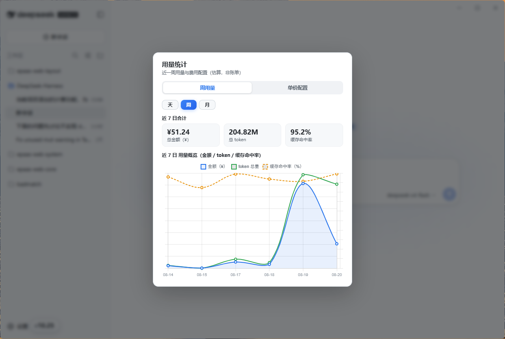

# DeepSeek-Harness

Tauri v2 桌面壳，将 [DeepSeek Harness](https://github.com/deepseek-ai/deepseek-harness) 的 Web UI（`dsh web`）嵌入系统 WebView，并支持计费功能。

**工作原理**：壳启动 `dsh --profile web --port 0` → 解析它打印的 URL → WebView 加载 → 窗口关闭时清理整个进程树。harness 本身零改动。



## 快速开始

前置要求：

- Rust 工具链（≥ 1.77）
- Node ≥ 22
- 全局安装 dsh：`npm i -g @deepseek-ai/dsh`（需为支持 `--no-open` 的新版，过低版本无法启动）
- WebView2 Runtime（Win11 自带，Win10 需安装）

```bash
npm install
npm run dev      # 开发运行
npm run build    # 打包 release
```

## 特性

- **即开即见**：窗口先显示带进度提示的占位页，dsh 就绪后自动切换到实际界面，冷启动不"黑屏"
- **共享配置**：不注入 DSH_HOME，桌面版与 CLI 共用同一套配置/会话/凭据（`~/.dsh`）
- **无边框窗口**：默认自定义标题栏（最小化 / 最大化 / 关闭），支持拖拽；可配置切换系统原生标题栏（见「配置」）
- **无控制台闪窗**：直接 spawn `node.exe`，不弹 cmd 窗口
- **启动日志**：所有关键步骤与 dsh 的 stderr 写入 `%LOCALAPPDATA%\deepseek-harness\startup.log`（不可写时回退 TEMP），"双击没反应"可从这里排查
- **每日用量徽标**：左下角 ¥ 胶囊实时显示当日估算费用，点击可编辑汇率与单价（见下文）
- **不弹系统浏览器**：以 `--no-open` 启动 dsh，界面只出现在窗口内；不再做 `--help` 特性探测，启动更快（要求全局 dsh 支持 `--no-open`）
- **更新提示**：每次启动检查 GitHub 最新版本（走 HTML 页面重定向，不占用 GitHub API 配额、静默失败、可配置更新源），有新版顶部横幅提示下载；点击"忽略此版本"后该版本不再提示
- **干净退出**：关闭窗口即杀掉 dsh 整棵进程树，无残留

## 开发注意

> ⚠️ 不要与正在运行的正式实例同时启动 dev：两个实例并发读写同一 session 文件（`~/.dsh/sessions/...`）会触发 zstd 日志损坏崩溃。测试前先退出正式实例，或用 `$env:DSH_HOME = "<临时目录>"` 隔离。

## 配置

可选配置放在 dsh 数据目录的 `storages` 下，不配置则全部用默认值。**首次启动会自动创建** `desktop-settings.json`（写入默认值，方便发现与修改）：

- 设置了 `$DSH_HOME` 时：`$DSH_HOME/storages/desktop-settings.json`（`DSH_HOME` 即 `.dsh` 目录本身，与 CLI 约定一致）
- 未设置 `$DSH_HOME` 时：`~/.dsh/storages/desktop-settings.json`

```json
{ "decorations": true, "usageBadge": true, "updateCheck": true }
```

| 字段 | 默认 | 说明 |
|---|---|---|
| `decorations` | `false` | `true` 时改用系统原生标题栏（隐藏自定义最小化/最大化/关闭按钮）；**重启应用生效** |
| `usageBadge` | `true` | `false` 时**整个金额统计功能关闭**：不显示左下角 ¥ 胶囊、不启动统计 sidecar（无实时更新）、不注入统计弹窗 |
| `updateCheck` | `true` | 是否在启动时检查 GitHub 更新；`false` 则跳过网络请求 |
| `updateEndpoint` | HTML latest 页 | 自定义更新源，默认 `https://github.com/ai-written/DeepSeek-Harness/releases/latest`（HTML 重定向，不占 API 配额），可改为镜像 |
| `ignoredUpdate` | — | 已忽略的版本（如 `v0.1.6`），由"忽略此版本"按钮写入 |

> 每次启动检查一次、静默失败：后台线程 9 秒超时，先请求 HTML 的 `/releases/latest` 页面（302 重定向到最新 tag，**不消耗 GitHub API 配额**），失败时回退 GitHub API；有新版本时顶部弹出横幅（前往下载 / 忽略此版本），每次启动都会弹出（点 × 仅关闭本次），点击"忽略此版本"后该版本不再提示。发布说明（notes）尽力从 API 获取，失败时横幅照常弹出但无备注文字。
> **生效检查**：日志会打印 `update check` / `native window decorations` / `usage badge` 等行。

同目录的 `usage-pricing.json` 是计费价格/汇率配置（见「每日用量徽标」）。

## 打包发布

```bash
npm run build
```

产物（`src-tauri/target/release/` 下）：

| 产物 | 说明 |
|---|---|
| `deepseek-harness.exe` | 免安装版，单文件双击即用；CI 发布为 `DeepSeek-Harness_<version>_x64-portable.exe` |
| `bundle/nsis/DeepSeek-Harness_<version>_x64-setup.exe` | NSIS 安装包 |
| `bundle/msi/DeepSeek-Harness_<version>_x64_en-US.msi` | MSI 安装包 |

> **免安装版首次运行**：浏览器下载的 exe 带"来自互联网"标记，SmartScreen 可能静默拦截双击。右键 exe → 属性 → 勾选**解除锁定**（或 `Unblock-File`）。彻底解决需代码签名。
>
> 目标机器需 Node ≥ 22 + 全局 `@deepseek-ai/dsh`（支持 `--no-open` 的版本）；安装包本身**不含 dsh**。

## 每日用量徽标

主窗口左下角的「¥X.XX」胶囊显示当天使用 dsh 的估算费用（人民币），实时刷新；点击可查看当日 24 小时 / 近 7 日 / 近 30 日 / 近 12 个月用量图表（含金额、token、请求数、缓存命中率合计），可按会话日志中的 `provider` 字段筛选供应商，并编辑汇率与单价。

- **实现**：壳额外 spawn 一个 node sidecar（`src-tauri/usage/usage-sidecar.mjs`），折叠 `~/.dsh/sessions` 会话日志（支持 `session.jsonl(.zstd)` 和 `session.vN.jsonl(.zstd)` 版本格式），按 `provider` / 模型分桶并每 3 秒增量刷新；统计缓存保存于 `~/.dsh/storages/usage-cache.json`，启动先读取缓存，只重算新增或变化的日志，删除日志时保留缓存中的历史统计；打开用量弹窗时暂停轮询，以弹窗打开瞬间的数据为准，关闭后立即恢复；Rust 侧将数据转发为 `dsh-usage` 事件，页面内注入的 `src-tauri/usage-panel.js` 监听并渲染。回归验证：`node src-tauri/usage/context-tier.verify.mjs`（上下文倍率端到端）与 `node src-tauri/usage/context-tier.v1migration.verify.mjs`（缓存 v1→v2 迁移）
- **价格配置**：`~/.dsh/storages/usage-pricing.json`（`exchangeRate` / `default` / `overrides`），支持按模型倍率、上下文长度档位与峰时时段计价；sidecar 每次刷新重读，改动即时生效
- **上下文倍率**：`contextMultiplier` 可写在顶层（默认行，作用于所有未单独配置的模型）或某个 override 行；字段形如 `{ "threshold": 64000, "multiplier": 1.5 }`。`threshold` 单位为 **token**，可为裸数字或带 `K`/`M`/`B` 后缀的字符串（大小写不限、可带小数与空格，如 `"128K"`、`"1.5M"`、`"2B"`）；界面与配置文件都支持该写法，**保存时按输入的紧凑形式原样保留（纯数字则存数值），仅在内部计价时换算成 token 数**，避免界面显示一长串大数字。某次请求的「上下文长度」按该请求的输入 token（未缓存输入 + 缓存读取 + 缓存写入）计，**严格大于 `threshold`** 时，本次请求的输入与输出费用整体乘以 `multiplier`（留空/缺省 = 不启用，保持原价；`multiplier` 需为正数）。sidecar 缓存每次请求的原始用量，改阈值或倍率后历史金额会随刷新重算
- **计价单位**：`default.currency` 与各 override 行的 `currency` 可选 `"cny"`（人民币，缺省）或 `"usd"`（美元）；旧配置缺省该字段时按人民币计
- **合计币种**：顶层 `totalCurrency` 可选 `"cny"`（缺省）或 `"usd"`，决定所有金额合计的币种；各行价格按计价单位换算到合计币种，**计价单位与合计币种一致时不经汇率**（全部按人民币计价时无需汇率换算）；徽标与图表始终以人民币显示
- **单价匹配优先级**：`overrides` 的键支持 `模型名`、`provider|模型名`、`provider|*`、`*|模型名` 四种写法；逐价格字段按「纯模型名 > `provider|模型名` > `provider|*` > `*|模型名`」取最高优先级匹配，高优先级行未定义的字段由低优先级行补全（同一键只保留一行，界面保存时会拒绝重复键）

峰时档位（`timeOfUse`）可选字段 `days` 限定峰时适用日期，缺省 `all`（每天，行为与旧版一致）：

```json
"timeOfUse": { "enabled": true, "days": "weekday", "peakMultiplier": 2, "valleyMultiplier": 1, "peakRanges": [[9, 12], [14, 18]] }
```

- `days`：`"all"`（默认）| `"weekday"`（周一至周五）| `"weekend"`（周六、周日）| 整数数组如 `[1,2,3,4,5]`（1=周一 … 7=周日）
- 语义：**不匹配的日期按原价（倍率 1）**，当天峰时配置不生效；匹配的日期内，落在 `peakRanges` 的小时按 `peakMultiplier`（峰时倍率，按不低于 ×1 计，填 0/负数等同 1），其余小时按 `valleyMultiplier`（谷时倍率，界面固定为 1，即原价）
- 法定节假日暂不特殊处理，按普通工作日计

上下文倍率示例（override 行与顶层写法相同）：当 `deepseek-v4-pro` 的某次请求输入超过 12 万 token 时，该次请求按 1.5 倍计价：

```json
"overrides": {
  "deepseek-v4-pro": {
    "inputPerMillion": 4.5,
    "outputPerMillion": 13.5,
    "contextMultiplier": { "threshold": 120000, "multiplier": 1.5 }
  }
}
```

各倍率的生效顺序（相乘）：峰时档位倍率（按小时/日期）→ 模型倍率 `multiplier` → 上下文倍率 `contextMultiplier`（按请求）→ 币种换算。峰值/谷值判定沿用按小时聚合的旧口径；一旦缓存重建为 v2（含逐请求用量）后，上下文档位按每次请求精确判定。
- **只读与降级**：sidecar 只读日志、不写会话文件；脚本缺失或 node 不可用时仅日志告警，不影响主功能
- **打包**：脚本作为资源打进安装包（从 `resource_dir()` 定位），同时以 `include_str!` 嵌入 exe 本体——免安装版找不到外部脚本时会自动解压到 `%LOCALAPPDATA%\deepseek-harness\` 再运行

## 目录结构

```
src-tauri/
├── src/main.rs             # 壳：spawn dsh、解析 URL、事件转发、进程清理
├── usage-panel.js          # 用量徽标 UI（注入页面）
├── usage/usage-sidecar.mjs # 用量统计 sidecar
├── window-controls.js      # 自定义标题栏
└── tauri.conf.json         # Tauri 配置（含资源打包）
.github/workflows/release.yml  # 推送 v* tag 自动构建并发布 GitHub Release
```
